# SCHOOL Yearbook

```{=html}
<style>
/* Responsive yearbook rows using Quarto columns */
.yearbook-row{
  align-items: start;
  margin: 0.75rem 0 1.25rem;
  gap: 1rem;
}

/* Card styling */
.yearbook-card{
  border: 1px solid #dddddd;
  border-radius: 12px;
  padding: 0.75rem;
  text-align: center;
}

/* Images: responsive square crop */
.yearbook-card img{
  width: 100%;
  aspect-ratio: 1 / 1;
  object-fit: cover;      /* change to contain if you prefer no cropping */
  border-radius: 10px;
  display: block;
  margin: 0 auto 0.6rem;
}

/* Text */
.yearbook-name{
  font-weight: 700;
  margin: 0.25rem 0 0.4rem;
}
.yearbook-role{
  margin: 0;
  font-size: 0.95rem;
  line-height: 1.25;
}

/* Responsive overrides: stack columns on smaller screens */
@media (max-width: 992px){
  .yearbook-row > .column{ flex: 0 0 calc(33.333% - 1rem) !important; max-width: calc(33.333% - 1rem) !important; }
}
@media (max-width: 700px){
  .yearbook-row > .column{ flex: 0 0 calc(50% - 1rem) !important; max-width: calc(50% - 1rem) !important; }
}
@media (max-width: 420px){
  .yearbook-row > .column{ flex: 0 0 100% !important; max-width: 100% !important; }
}
</style>
 
```

<hr>

<!-- ### Core Team 
<table>
  <tr> 
    <th></th>
    <th></th>
    <th></th>
    <th></th>
    <th></th>
  </tr>
<tr>
    <td>**Deborah Balk**</td>
    <td>**Josh Brinks**</td>
    <td>**Iris Cano**</td>
    <td>**Christina Alexia Deodatis**</td>
    <td>**Hasim Engin**</td>
  </tr>
   <tr>
     <td>Director at the [CUNY Institute for Demographic Research](https://www.cuny.edu/about/centers-and-institutes/demographic-research/) and professor at [Baruch College](https://www.baruch.cuny.edu/)</td>
    <td>Research Scientist at [iSciences](https://www.isciences.com/)</td>
    <td>Research Associate at [CUNY](https://www.cuny.edu/about/centers-and-institutes/demographic-research/)</td>
    <td>Research Staff Assistant at [CIESIN, Columbia Climate School](https://www.ciesin.columbia.edu/index.html)</td>
    <td>Geographic Information Specialist at [CIESIN, Columbia Climate School](https://www.ciesin.columbia.edu/index.html)</td>
  </tr>
</table>
<table>
  <tr>
    <th></th>
    <th></th>
    <th></th>
    <th></th>
     <th></th>
  </tr>
<tr>
    <td>**Elaine Famutimi**</td>
    <td>**Camilla Green**</td>
    <td>**Kytt MacManus**</td>
    <td>**Juan Fernando Martinez**</td>
    <td>**Thomas Parris**</td>
  </tr>
   <tr>
    <td>Research Associate at [CUNY](https://www.cuny.edu/about/centers-and-institutes/demographic-research/)</td>
    <td>Research Staff Assistant at [CIESIN, Columbia Climate School](https://www.ciesin.columbia.edu/index.html)</td>
    <td>Applied Science Lead at the Environmental Flow Physics Lab [(EFPL), Columbia SEAS](https://efpl.engineering.columbia.edu/)</td>
    <td>Senior Research Staff Assistant at [CIESIN, Columbia Climate School](https://www.ciesin.columbia.edu/index.html)</td>
    <td>President at [iSciences](https://www.isciences.com/)</td>
  </tr>
</table>
<table>
  <tr> 
    <th></th>
    <th></th>
    <th></th>
    <th></th>
    <th></th>
  </tr>
<tr>
    <td>**Linda Pistolesi**</td>
    <td>**Sri Vinay**</td>
    <td>**Greg Yetman**</td>
    <td>**Eulalia Santin**</td>
    <td>**Lixiang Tracy Wen**</td>
  </tr>
   <tr>
    <td>Senior Geographic Information Specialist at [CIESIN, Columbia Climate School](https://www.ciesin.columbia.edu/index.html)</td>
    <td>Deputy Manager & System Engineer at NASA Socioeconomic Data and Applications Center $($[SEDAC](https://sedac.ciesin.columbia.edu/)$)$ and Associate Director for IT at [CIESIN, Columbia Climate School](https://www.ciesin.columbia.edu/index.html)</td>
    <td>Associate Director for Geospatial Applications at [CIESIN, Columbia Climate School](https://www.ciesin.columbia.edu/index.html)</td>
    <td>Associate Director of Finance & Administration at [CIESIN, Columbia Climate School](https://www.ciesin.columbia.edu/index.html)</td>
    <td>Senior Finance Manager at [CIESIN, Columbia Climate School](https://www.ciesin.columbia.edu/index.html)</td>
  </tr>  
  </table>

<hr>

### Consultation Team, Subject Matter Experts (SMEs)
<table>
  <tr>
    <th>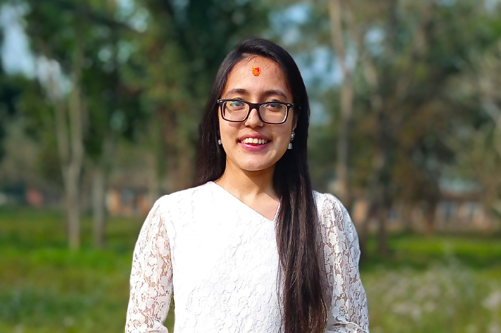</th>
    <th>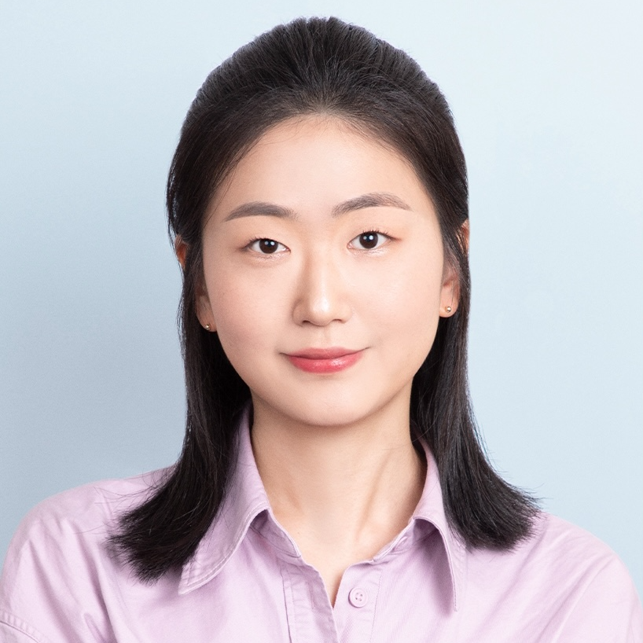</th>
    <th></th>
     <th>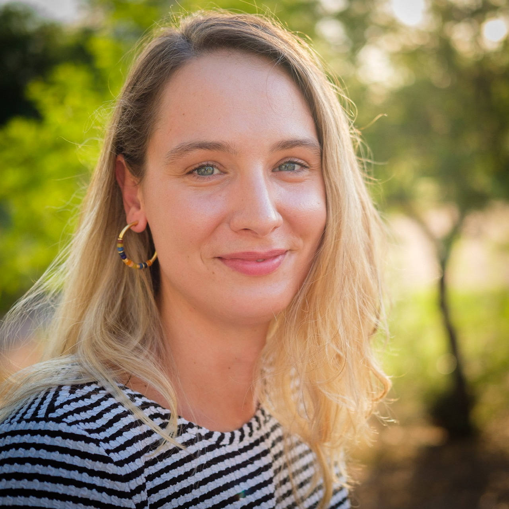</th>
    <th></th>
  </tr>
<tr>
    <td>**Shristi Adhikari**</td>
    <td>**Yoonjung Ahn**</td>
    <td>**Antonio Tovar**</td>
    <td>**Anne-Lise Boyer**</td>
    <td>**Robert Chen**</td>
  </tr>
   <tr>
    <td>Master's Student in Environmental Studies at the [Kentucky State University](https://www.kysu.edu/)</td>
    <td>Assistant professor in the Department of Geography & Atmospheric Science at the [University of Kansas](https://geog.ku.edu/)</td>
    <td>Assistant Professor of Computer Science and Information Systems at [National Louis University](https://nl.edu/undergraduate-college/ug-faculty-and-staff/)</td>
    <td>Postdoctoral Research Associate at [The University of Arizona College of Architecture, Planning & Landscape Architecture](https://capla.arizona.edu/)</td>
    <td>Director Emeritus, [CIESIN](https://www.ciesin.columbia.edu/), Columbia Climate School, Columbia University and Manager Emeritus, NASA Socioeconomic Data and Applications Center [(SEDAC)](https://sedac.ciesin.columbia.edu/)</td>
  </tr>
</table>
<table>
  <tr> 
    <th></th> 
    <th>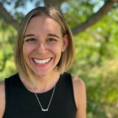</th>
    <th>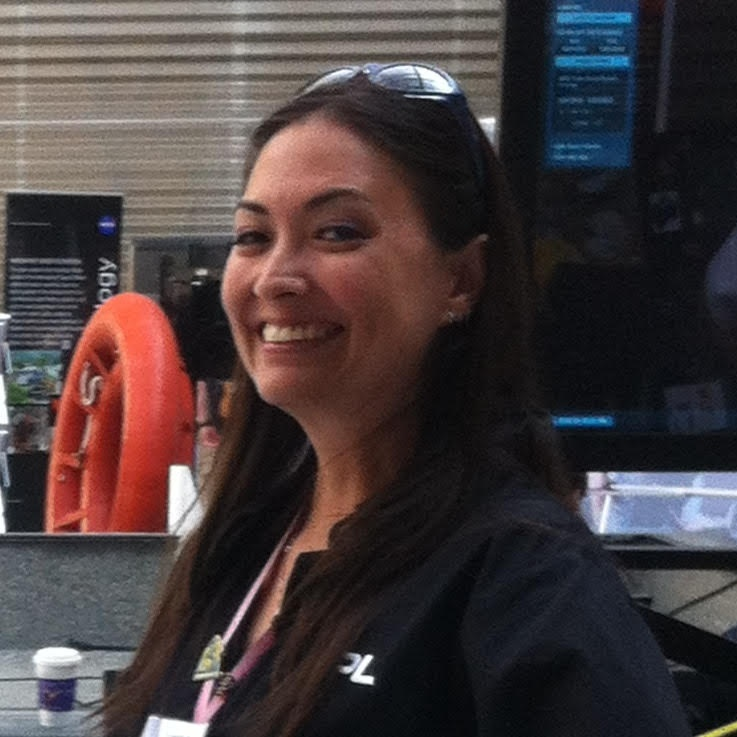</th>
    <th>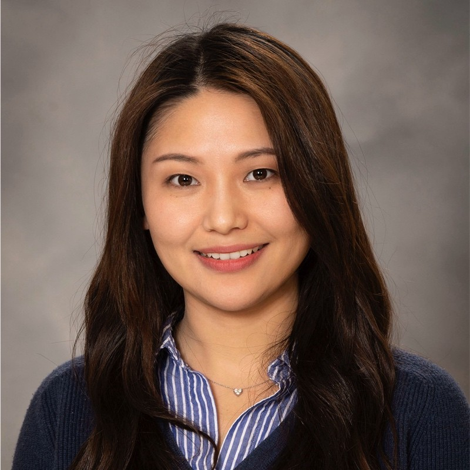</th>
    <th>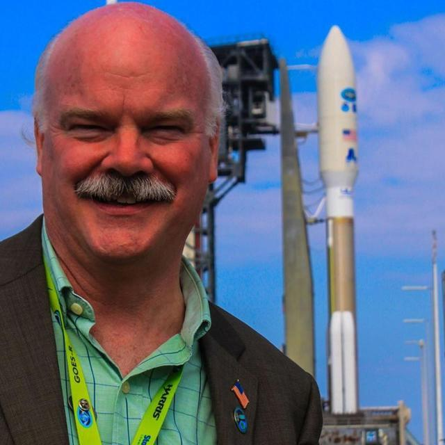</th>
  </tr>
<tr>
    <td>**Nancy Degnan**</td>
    <td>**Elizabeth Dzwonczyk**</td>
    <td>**Maggi Glasscoe**</td>
    <td>**Qian Huang**</td>
    <td>**Dave Jones**</td>
  </tr>
 <tr>
    <td>Senior Advisor for Education at [Columbia Water Center](https://water.columbia.edu/)</td>
    <td>PhD Candidate in Geography at the [University of Colorado Denver](https://clas.ucdenver.edu/ges/)</td>
    <td>Research Associate at the [University of Alabama–Huntsville](https://www.uah.edu/) and Disasters Coordinator for [NASA’s Applied Sciences Disasters Program](https://appliedsciences.nasa.gov/what-we-do/disasters)</td>
    <td>Research Assistant Professor at East Tennessee State University College of Public Health, [Center for Rural Health Research](https://www.etsu.edu/cph/rural-health-research/)</td>
    <td>Founder and CEO at [StormCenter Communications, Inc.](https://geocollaborate.com/)</td>
  </tr>
</table>
<table>
  <tr> 
    <th>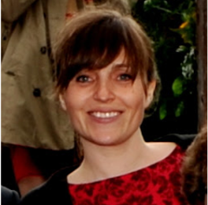</th> 
    <th></th>
    <th>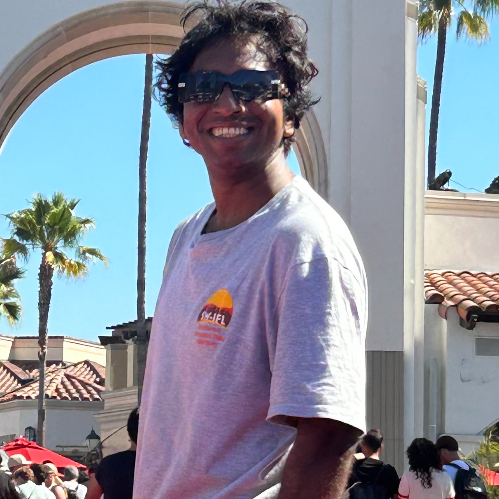</th>
    <th>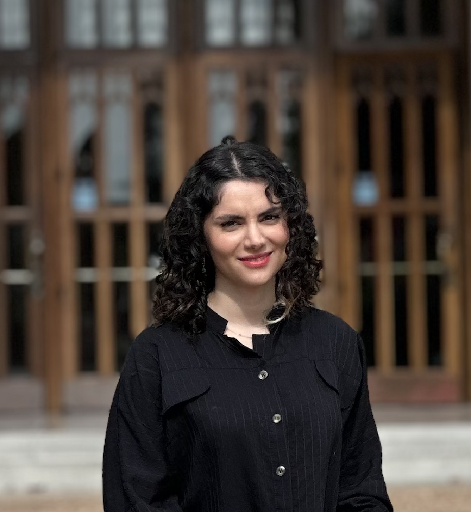</th>
    <th>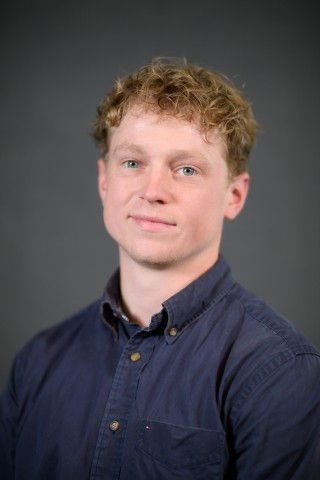</th>

  </tr>
<tr>
    <td>**Laureline Josset**</td>
    <td>**Ryan Mead**</td>
    <td>**Alamin Molla**</td>
    <td>**Faezeh Najafzadeh**</td>
    <td>**Jacob Orser**</td>
  </tr>
<tr>
    <td>Associate Research Scientist at [Columbia Water Center](https://water.columbia.edu/)</td>
    <td>Coordinator of Academic Support Services for the Educational Oportunity Program at [SUNY Binghamton](https://www.binghamton.edu/programs/eop/about/staff.html)</td>
    <td>Ph.D. GIScience Student, School of Geographical Sciences and Urban Planning; [Arizona State University](https://sgsup.asu.edu/) Graduate Researcher, [Urban Climate Research Center](https://ucrc.asu.edu/)</td>
    <td>PhD Candidate in Geography and Environmental Sustainability at the [University of Oklahoma](https://www.ou.edu/ags/geography)</td>
    <td>Program Support Specialist at [NASA Acres](https://www.nasaacres.org/)</td>
  </tr>
</table>
<table>
  <tr>  
    <th>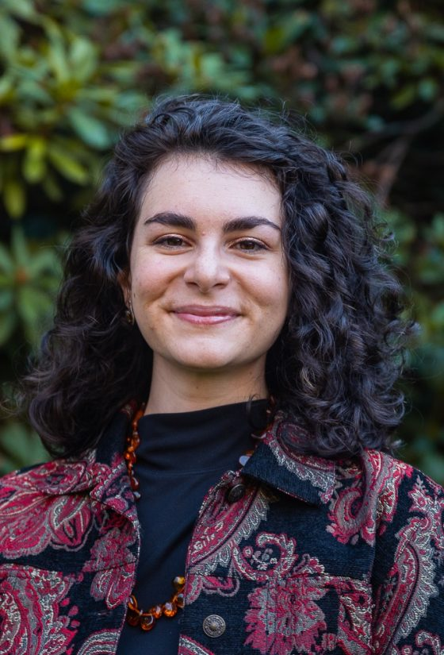</th>
    <th></th>
    <th></th>
    <th>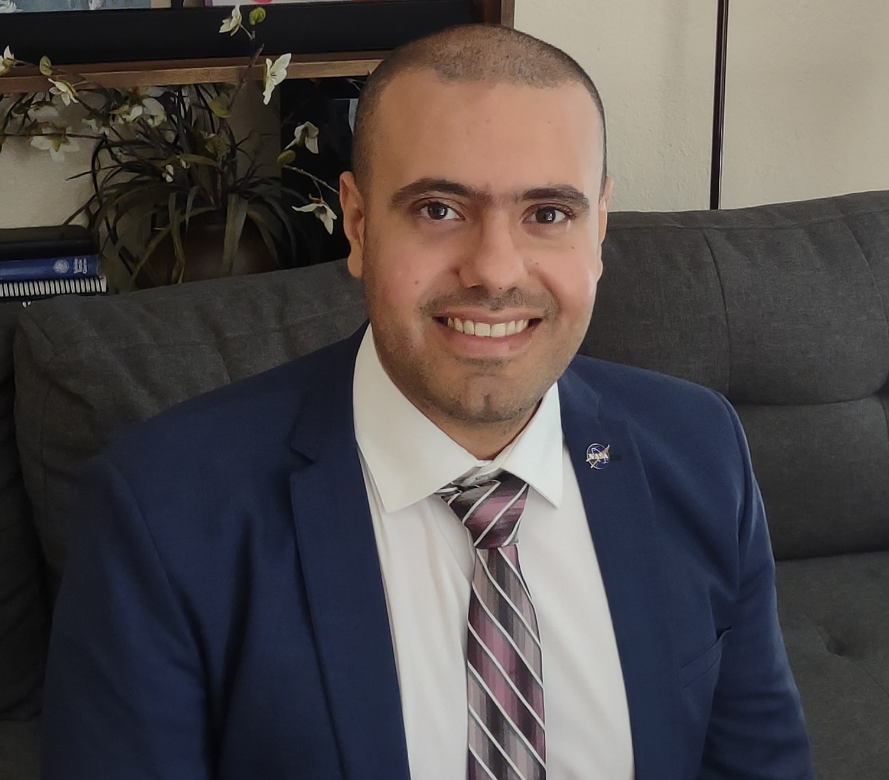</th>
  </tr>
<tr>
    <td>**Masha Vernik**</td>
    <td>**Dhruvil Prajapati**</td>
    <td>**Akshay Arvind Mestry**</td>
    <td>**Hazem Mahmoud**</td>
  </tr>
   <tr>
    <td>Master's Student at the [University of Washington School of Environmental and Forest Sciences](https://sefs.uw.edu/)</td>  
    <td>Math & Computer Science Support Specialist at [National Louis University](https://nl.edu/learning-support/meet-the-learning-support-team/)</td>
    <td>Computer Science Adjunct at [National Louis University](https://nl.edu/undergraduate-college/ug-faculty-and-staff/)</td>
    <td>Science Lead at the [NASA Atmospheric Science Data Center (ASDC)](https://science.larc.nasa.gov/people/hazem-mahmoud/)</td>
  </tr>
</table>

  <hr>

### Open Science Team Members
<table>
  <tr> 
    <th></th>
    <th></th>
    <th>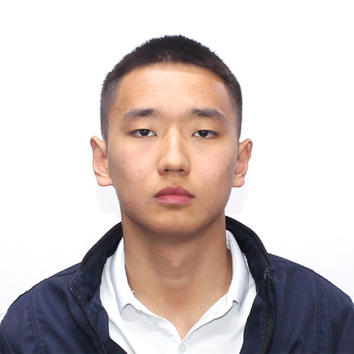</th>
    <th>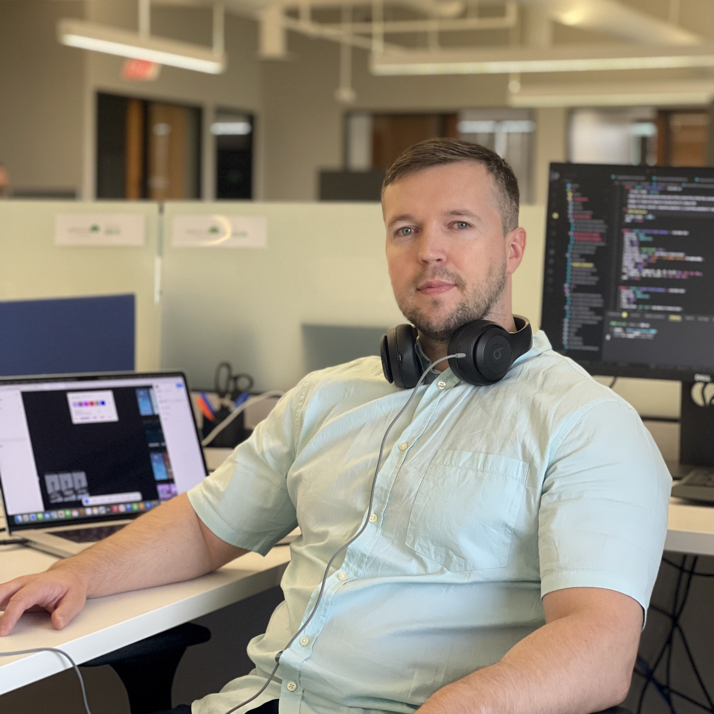</th>
    <th></th>
  </tr>
<tr>
    <td>**Navin Aade**</td>
    <td>**Mykola Dydych**</td>
    <td>**Eldar Imanbekov**</td>
    <td>**Alexandr Smagin**</td>
    <td>**Hieu Tran**</td>
  </tr>
</table>
<table>
  <tr> 
    <th>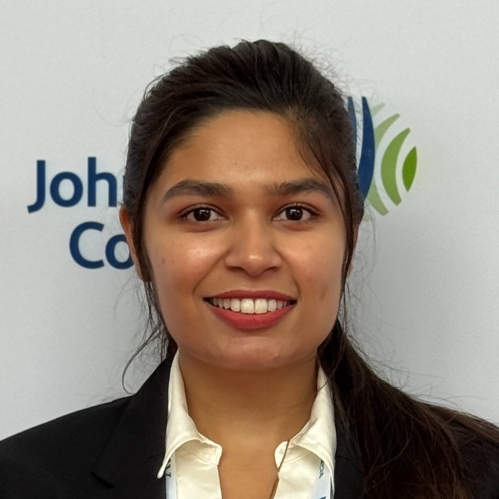</th>
    <th>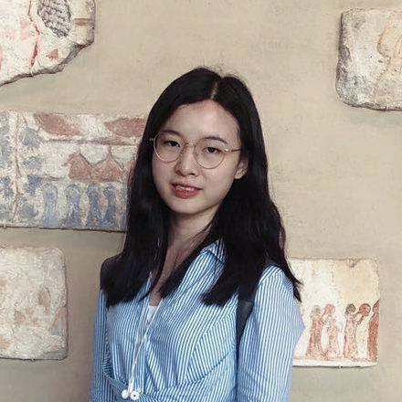</th>
    <th></th>
    <th></th>
    <th></th>
  </tr>
<tr>
    <td>**Poornima Vaidya**</td>
    <td>**Jinyi Cai**</td>
    <td>**Raphael Sutiono**</td>
    <td>**Emanuel Agú**</td>
    <td>**Ahanaf Aziz**</td>
  </tr>
  <tr> 
    <th></th>
    <th></th>
    <th></th> 
    <th></th>
    <th>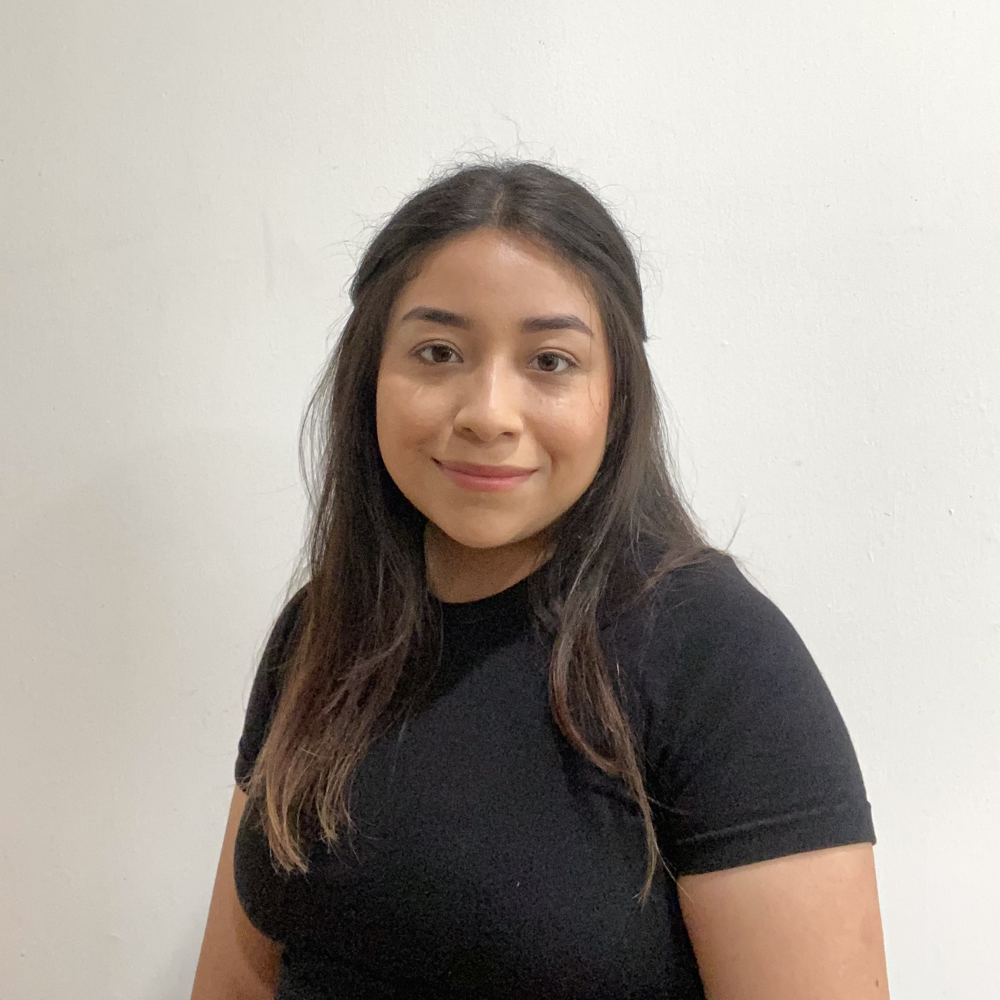</th>
  </tr>
<tr>
    <td>**Denisse Fierro Arcos**</td>
    <td>**Rosana Aguilera Becker**</td>
    <td>**Tricia Boucher**</td> 
    <td>**Shemontee Chowdhury**</td>
    <td>**America Munoz**</td>
  </tr>

</table>
<table>
  <tr> 
    <th></th> 
    <th></th>
    <th></th>
    <th></th>
    <th></th>
  </tr>
<tr>
    
    <td>**Karen E. Cowen**</td>
    <td>**Nikolas Fisher**</td>
    <td>**Iker Gomez**</td>
    <td>**Jenny Hewson**</td>
    <td>**Josie Morkin**</td>
    </tr>
</table>
<table>
  <tr> 
    <th></th>
    <th></th>
    <th></th>
    <th></th>
    <th></th>
  </tr>
<tr>
    <td>**Peer Herholz**</td>
    <td>**David Lee**</td>
    <td>**Jorge Lopez**</td>
    <td>**Robyn Marowitz**</td>
    <td>**Khateeja Khatoon**</td>
</tr>
</table>
<table>
  <tr> 
    <th></th>  
    <th></th>  
    <th></th>
    <th></th>
    <th></th>
  </tr>
<tr>
    <td>**Arina Moroz**</td>   
    <td>**Robinson Muiru**</td>
    <td>**Ulugbek Medetov**</td>
    <td>**Lara Pistolesi**</td>
    <td>**Annajiat Alim Rasel**</td>
</tr>
</table>
<table>
  <tr> 
    <th></th>
    <th>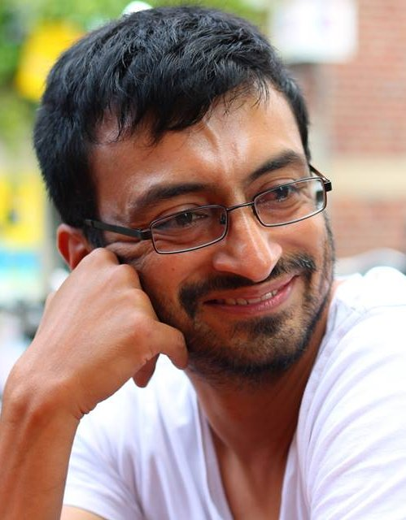</th>
    <th></th>
    <th></th>
    <th></th>
  </tr>
<tr>
    <td>**Luana Sales**</td>    
    <td>**Alber Sanchez**</td>
    <td>**Jonathan Sanchez**</td>
    <td>**Aneese Williams**</td>
    <td>**Xuan Zhou**</td>
</tr>
</table>
<table>
  <tr> 
    <th></th>
    <th></th>
    <th></th>
    <th></th>
    <th></th>
  </tr>
<tr>
    <td>**Brandon Ortiz**</td>
    <td>**Muhammad Kamboh**</td>
    <td>**Buzeinep Ysmanalieva**</td>
    <td>**Crystal Villa**</td>
    <td>**Daisy Guzman**</td>
  </tr>
</table>

<table>
  <tr> 
    <th></th>
    <th></th>
    <th></th>
    <th></th>
    <th></th>
  </tr>
<tr>
    <td>**David Fonseca**</td>
    <td>**Diego Lozano**</td>
    <td>**Enxhi Merkaj**</td>
    <td>**Francisco Sanchez**</td>
    <td>**Gianna Dubinksi**</td>
  </tr>
</table>

<table>
  <tr> 
    <th></th>
    <th></th>
    <th></th>
  </tr>
<tr>
    <td>**Miguel Dominguez**</td>
    <td>**Stevaughn Borders**</td>
    <td>**Steven Sanchez**</td>
  </tr>
</table> -->


### Core Team

::: {.columns .yearbook-row}
::: {.column width="20%"}
::: {.yearbook-card}

{alt="Deborah Balk"}
::: {.yearbook-name}Deborah Balk:::
::: {.yearbook-role}
Director at the CUNY Institute for Demographic Research
 and professor at Baruch College

:::
:::
:::

::: {.column width="20%"}
::: {.yearbook-card}
{alt="Josh Brinks"}
::: {.yearbook-name}Josh Brinks:::
::: {.yearbook-role}
Research Scientist at iSciences

:::
:::
:::

::: {.column width="20%"}
::: {.yearbook-card}
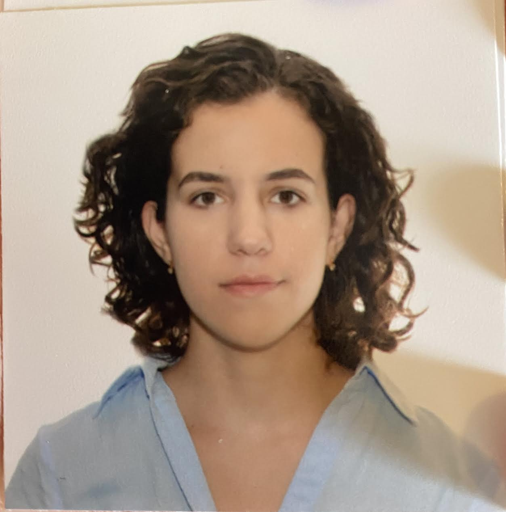{alt="Iris Cano"}
::: {.yearbook-name}Iris Cano:::
::: {.yearbook-role}
Research Associate at CUNY

:::
:::
:::

::: {.column width="20%"}
::: {.yearbook-card}
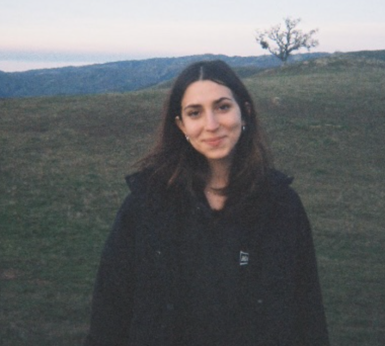{alt="Christina Alexia Deodatis"}
::: {.yearbook-name}Christina Alexia Deodatis:::
::: {.yearbook-role}
Research Staff Assistant at CIESIN, Columbia Climate School

:::
:::
:::

::: {.column width="20%"}
::: {.yearbook-card}
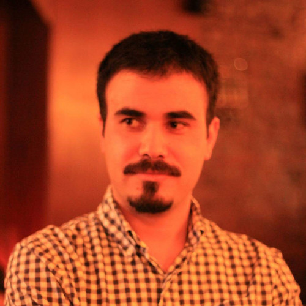{alt="Hasim Engin"}
::: {.yearbook-name}Hasim Engin:::
::: {.yearbook-role}
Geographic Information Specialist at CIESIN, Columbia Climate School

:::
:::
:::
:::

::: {.columns .yearbook-row}
::: {.column width="20%"}
::: {.yearbook-card}
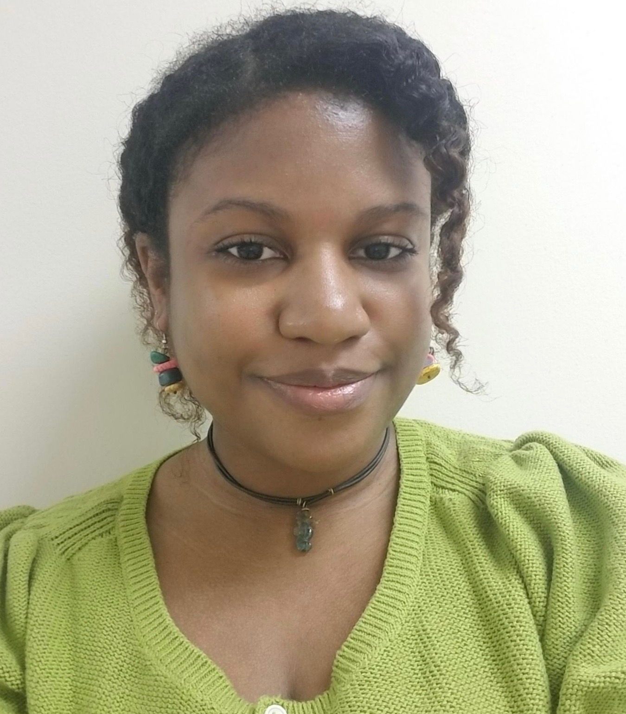{alt="Elaine Famutimi"}
::: {.yearbook-name}Elaine Famutimi:::
::: {.yearbook-role}
Research Associate at CUNY

:::
:::
:::

::: {.column width="20%"}
::: {.yearbook-card}
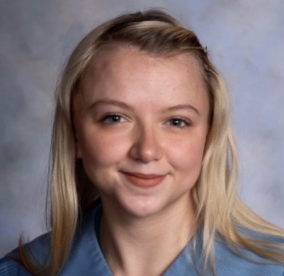{alt="Camilla Green"}
::: {.yearbook-name}Camilla Green:::
::: {.yearbook-role}
Research Staff Assistant at CIESIN, Columbia Climate School

:::
:::
:::

::: {.column width="20%"}
::: {.yearbook-card}
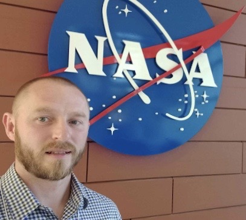{alt="Kytt MacManus"}
::: {.yearbook-name}Kytt MacManus:::
::: {.yearbook-role}
Applied Science Lead at the Environmental Flow Physics Lab (EFPL), Columbia SEAS

:::
:::
:::

::: {.column width="20%"}
::: {.yearbook-card}
{alt="Juan Fernando Martinez"}
::: {.yearbook-name}Juan Fernando Martinez:::
::: {.yearbook-role}
Senior Research Staff Assistant at CIESIN, Columbia Climate School

:::
:::
:::

::: {.column width="20%"}
::: {.yearbook-card}

{alt="Thomas Parris"}
::: {.yearbook-name}Thomas Parris:::
::: {.yearbook-role}
President at iSciences

:::
:::
:::
:::

::: {.columns .yearbook-row}
::: {.column width="20%"}
::: {.yearbook-card}
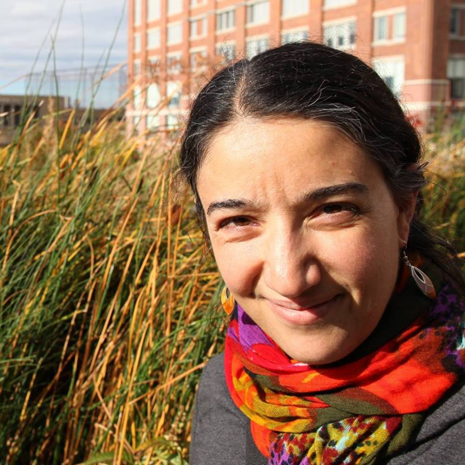{alt="Linda Pistolesi"}
::: {.yearbook-name}Linda Pistolesi:::
::: {.yearbook-role}
Senior Geographic Information Specialist at CIESIN, Columbia Climate School

:::
:::
:::

::: {.column width="20%"}
::: {.yearbook-card}
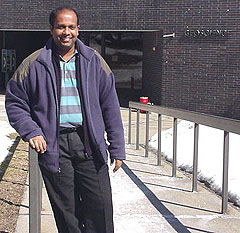{alt="Sri Vinay"}
::: {.yearbook-name}Sri Vinay:::
::: {.yearbook-role}
Deputy Manager & System Engineer at NASA Socioeconomic Data and Applications Center (SEDAC
) and Associate Director for IT at CIESIN, Columbia Climate School

:::
:::
:::

::: {.column width="20%"}
::: {.yearbook-card}
{alt="Greg Yetman"}
::: {.yearbook-name}Greg Yetman:::
::: {.yearbook-role}
Associate Director for Geospatial Applications at CIESIN, Columbia Climate School

:::
:::
:::

::: {.column width="20%"}
::: {.yearbook-card}
{alt="Eulalia Santin"}
::: {.yearbook-name}Eulalia Santin:::
::: {.yearbook-role}
Associate Director of Finance & Administration at CIESIN, Columbia Climate School

:::
:::
:::

::: {.column width="20%"}
::: {.yearbook-card}
{alt="Lixiang Tracy Wen"}
::: {.yearbook-name}Lixiang Tracy Wen:::
::: {.yearbook-role}
Senior Finance Manager at CIESIN, Columbia Climate School

:::
:::
:::
:::

### Consultation Team, Subject Matter Experts (SMEs)

::: {.columns .yearbook-row}
::: {.column width="20%"}
::: {.yearbook-card}

{alt="Shristi Adhikari"}
::: {.yearbook-name}Shristi Adhikari:::
::: {.yearbook-role}
Master's Student in Environmental Studies at the Kentucky State University

:::
:::
:::

::: {.column width="20%"}
::: {.yearbook-card}

{alt="Yoonjung Ahn"}
::: {.yearbook-name}Yoonjung Ahn:::
::: {.yearbook-role}
Assistant professor in the Department of Geography & Atmospheric Science at the University of Kansas

:::
:::
:::

::: {.column width="20%"}
::: {.yearbook-card}

{alt="Antonio Tovar"}
::: {.yearbook-name}Antonio Tovar:::
::: {.yearbook-role}
Assistant Professor of Computer Science and Information Systems at National Louis University

:::
:::
:::

::: {.column width="20%"}
::: {.yearbook-card}

{alt="Anne-Lise Boyer"}
::: {.yearbook-name}Anne-Lise Boyer:::
::: {.yearbook-role}
Postdoctoral Research Associate at The University of Arizona College of Architecture, Planning & Landscape Architecture

:::
:::
:::

::: {.column width="20%"}
::: {.yearbook-card}

{alt="Robert Chen"}
::: {.yearbook-name}Robert Chen:::
::: {.yearbook-role}
Director Emeritus, CIESIN
, Columbia Climate School, Columbia University and Manager Emeritus, NASA Socioeconomic Data and Applications Center (SEDAC
)
:::
:::
:::
:::

::: {.columns .yearbook-row}
::: {.column width="20%"}
::: {.yearbook-card}

{alt="Nancy Degnan"}
::: {.yearbook-name}Nancy Degnan:::
::: {.yearbook-role}
Senior Advisor for Education at Columbia Water Center

:::
:::
:::

::: {.column width="20%"}
::: {.yearbook-card}

{alt="Elizabeth Dzwonczyk"}
::: {.yearbook-name}Elizabeth Dzwonczyk:::
::: {.yearbook-role}
PhD Candidate in Geography at the University of Colorado Denver

:::
:::
:::

::: {.column width="20%"}
::: {.yearbook-card}

{alt="Maggi Glasscoe"}
::: {.yearbook-name}Maggi Glasscoe:::
::: {.yearbook-role}
Research Associate at the University of Alabama–Huntsville
 and Disasters Coordinator for NASA’s Applied Sciences Disasters Program

:::
:::
:::

::: {.column width="20%"}
::: {.yearbook-card}

{alt="Qian Huang"}
::: {.yearbook-name}Qian Huang:::
::: {.yearbook-role}
Research Assistant Professor at East Tennessee State University College of Public Health, Center for Rural Health Research

:::
:::
:::

::: {.column width="20%"}
::: {.yearbook-card}

{alt="Dave Jones"}
::: {.yearbook-name}Dave Jones:::
::: {.yearbook-role}
Founder and CEO at StormCenter Communications, Inc.

:::
:::
:::
:::

::: {.columns .yearbook-row}
::: {.column width="20%"}
::: {.yearbook-card}

{alt="Laureline Josset"}
::: {.yearbook-name}Laureline Josset:::
::: {.yearbook-role}
Associate Research Scientist at Columbia Water Center

:::
:::
:::

::: {.column width="20%"}
::: {.yearbook-card}

{alt="Ryan Mead"}
::: {.yearbook-name}Ryan Mead:::
::: {.yearbook-role}
Coordinator of Academic Support Services for the Educational Oportunity Program at SUNY Binghamton

:::
:::
:::

::: {.column width="20%"}
::: {.yearbook-card}

{alt="Alamin Molla"}
::: {.yearbook-name}Alamin Molla:::
::: {.yearbook-role}
Ph.D. GIScience Student, School of Geographical Sciences and Urban Planning; Arizona State University
 Graduate Researcher, Urban Climate Research Center

:::
:::
:::

::: {.column width="20%"}
::: {.yearbook-card}

{alt="Faezeh Najafzadeh"}
::: {.yearbook-name}Faezeh Najafzadeh:::
::: {.yearbook-role}
PhD Candidate in Geography and Environmental Sustainability at the University of Oklahoma

:::
:::
:::

::: {.column width="20%"}
::: {.yearbook-card}

{alt="Jacob Orser"}
::: {.yearbook-name}Jacob Orser:::
::: {.yearbook-role}
Program Support Specialist at NASA Acres

:::
:::
:::
:::

::: {.columns .yearbook-row}
::: {.column width="25%"}
::: {.yearbook-card}

{alt="Masha Vernik"}
::: {.yearbook-name}Masha Vernik:::
::: {.yearbook-role}
Master's Student at the University of Washington School of Environmental and Forest Sciences

:::
:::
:::

::: {.column width="25%"}
::: {.yearbook-card}

{alt="Dhruvil Prajapati"}
::: {.yearbook-name}Dhruvil Prajapati:::
::: {.yearbook-role}
Math & Computer Science Support Specialist at National Louis University

:::
:::
:::

::: {.column width="25%"}
::: {.yearbook-card}

{alt="Akshay Arvind Mestry"}
::: {.yearbook-name}Akshay Arvind Mestry:::
::: {.yearbook-role}
Computer Science Adjunct at National Louis University

:::
:::
:::

::: {.column width="25%"}
::: {.yearbook-card}

{alt="Hazem Mahmoud"}
::: {.yearbook-name}Hazem Mahmoud:::
::: {.yearbook-role}
Science Lead at the NASA Atmospheric Science Data Center (ASDC)

:::
:::
:::
:::


### Open Science Team Members

::: {.columns .yearbook-row}
::: {.column width="20%"}
::: {.yearbook-card}
{alt="Navin Aade"}
::: {.yearbook-name}Navin Aade:::
:::
:::
:::

::: {.column width="20%"}
::: {.yearbook-card}

{alt="Mykola Dydych"}
::: {.yearbook-name}Mykola Dydych:::
:::
:::
:::

::: {.column width="20%"}
::: {.yearbook-card}

{alt="Eldar Imanbekov"}
::: {.yearbook-name}Eldar Imanbekov:::
:::
:::
:::

::: {.column width="20%"}
::: {.yearbook-card}

{alt="Alexandr Smagin"}
::: {.yearbook-name}Alexandr Smagin:::
:::
:::
:::

::: {.column width="20%"}
::: {.yearbook-card}

{alt="Hieu Tran"}
::: {.yearbook-name}Hieu Tran:::
:::
:::
:::
:::

::: {.columns .yearbook-row}
::: {.column width="20%"}
::: {.yearbook-card}

{alt="Poornima Vaidya"}
::: {.yearbook-name}Poornima Vaidya:::
:::
:::
:::

::: {.column width="20%"}
::: {.yearbook-card}

{alt="Jinyi Cai"}
::: {.yearbook-name}Jinyi Cai:::
:::
:::
:::

::: {.column width="20%"}
::: {.yearbook-card}

{alt="Raphael Sutiono"}
::: {.yearbook-name}Raphael Sutiono:::
:::
:::
:::

::: {.column width="20%"}
::: {.yearbook-card}

{alt="Emanuel Agú"}
::: {.yearbook-name}Emanuel Agú:::
:::
:::
:::

::: {.column width="20%"}
::: {.yearbook-card}

{alt="Ahanaf Aziz"}
::: {.yearbook-name}Ahanaf Aziz:::
:::
:::
:::
:::

::: {.columns .yearbook-row}
::: {.column width="20%"}
::: {.yearbook-card}

{alt="Denisse Fierro Arcos"}
::: {.yearbook-name}Denisse Fierro Arcos:::
:::
:::
:::

::: {.column width="20%"}
::: {.yearbook-card}

{alt="Rosana Aguilera Becker"}
::: {.yearbook-name}Rosana Aguilera Becker:::
:::
:::
:::

::: {.column width="20%"}
::: {.yearbook-card}

{alt="Tricia Boucher"}
::: {.yearbook-name}Tricia Boucher:::
:::
:::
:::

::: {.column width="20%"}
::: {.yearbook-card}

{alt="Shemontee Chowdhury"}
::: {.yearbook-name}Shemontee Chowdhury:::
:::
:::
:::

::: {.column width="20%"}
::: {.yearbook-card}

{alt="America Munoz"}
::: {.yearbook-name}America Munoz:::
:::
:::
:::
:::

::: {.columns .yearbook-row}
::: {.column width="20%"}
::: {.yearbook-card}
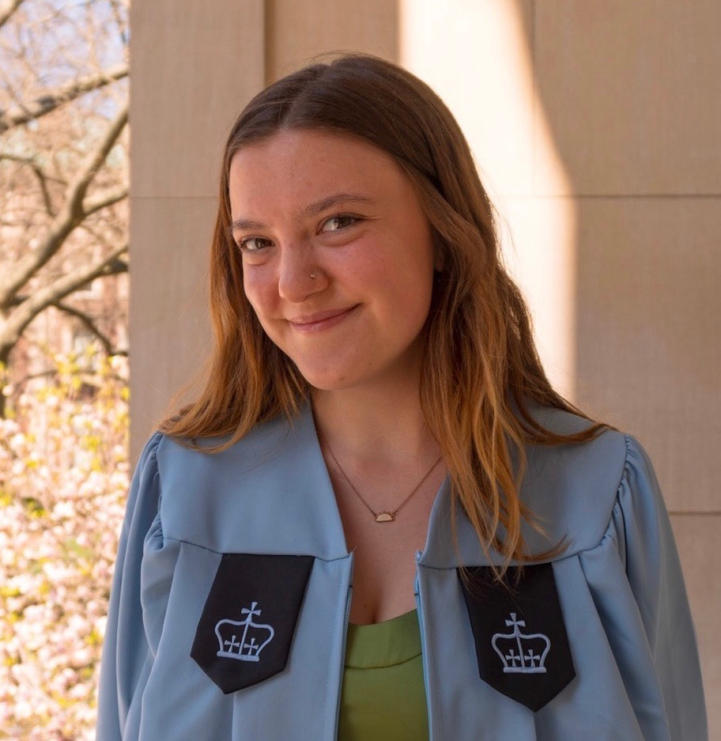{alt="Josie Morkin"}
::: {.yearbook-name}Josie Morkin:::
:::
:::
:::

::: {.column width="20%"}
::: {.yearbook-card}

{alt="Karen E. Cowen"}
::: {.yearbook-name}Karen E. Cowen:::
:::
:::
:::

::: {.column width="20%"}
::: {.yearbook-card}

{alt="Nikolas Fisher"}
::: {.yearbook-name}Nikolas Fisher:::
:::
:::
:::

::: {.column width="20%"}
::: {.yearbook-card}

{alt="Iker Gomez"}
::: {.yearbook-name}Iker Gomez:::
:::
:::
:::

::: {.column width="20%"}
::: {.yearbook-card}

{alt="Jenny Hewson"}
::: {.yearbook-name}Jenny Hewson:::
:::
:::
:::
:::

::: {.columns .yearbook-row}
::: {.column width="20%"}
::: {.yearbook-card}

{alt="Peer Herholz"}
::: {.yearbook-name}Peer Herholz:::
:::
:::
:::

::: {.column width="20%"}
::: {.yearbook-card}

{alt="David Lee"}
::: {.yearbook-name}David Lee:::
:::
:::
:::

::: {.column width="20%"}
::: {.yearbook-card}

{alt="Jorge Lopez"}
::: {.yearbook-name}Jorge Lopez:::
:::
:::
:::

::: {.column width="20%"}
::: {.yearbook-card}

{alt="Robyn Marowitz"}
::: {.yearbook-name}Robyn Marowitz:::
:::
:::
:::

::: {.column width="20%"}
::: {.yearbook-card}

{alt="Khateeja Khatoon"}
::: {.yearbook-name}Khateeja Khatoon:::
:::
:::
:::
:::

::: {.columns .yearbook-row}
::: {.column width="20%"}
::: {.yearbook-card}

{alt="Arina Moroz"}
::: {.yearbook-name}Arina Moroz:::
:::
:::
:::

::: {.column width="20%"}
::: {.yearbook-card}

{alt="Robinson Muiru"}
::: {.yearbook-name}Robinson Muiru:::
:::
:::
:::

::: {.column width="20%"}
::: {.yearbook-card}

{alt="Ulugbek Medetov"}
::: {.yearbook-name}Ulugbek Medetov:::
:::
:::
:::

::: {.column width="20%"}
::: {.yearbook-card}

{alt="Lara Pistolesi"}
::: {.yearbook-name}Lara Pistolesi:::
:::
:::
:::

::: {.column width="20%"}
::: {.yearbook-card}

{alt="Annajiat Alim Rasel"}
::: {.yearbook-name}Annajiat Alim Rasel:::
:::
:::
:::
:::

::: {.columns .yearbook-row}
::: {.column width="20%"}
::: {.yearbook-card}

{alt="Luana Sales"}
::: {.yearbook-name}Luana Sales:::
:::
:::
:::

::: {.column width="20%"}
::: {.yearbook-card}

{alt="Alber Sanchez"}
::: {.yearbook-name}Alber Sanchez:::
:::
:::
:::

::: {.column width="20%"}
::: {.yearbook-card}

{alt="Jonathan Sanchez"}
::: {.yearbook-name}Jonathan Sanchez:::
:::
:::
:::

::: {.column width="20%"}
::: {.yearbook-card}

{alt="Aneese Williams"}
::: {.yearbook-name}Aneese Williams:::
:::
:::
:::

::: {.column width="20%"}
::: {.yearbook-card}

{alt="Xuan Zhou"}
::: {.yearbook-name}Xuan Zhou:::
:::
:::
:::
:::

::: {.columns .yearbook-row}
::: {.column width="20%"}
::: {.yearbook-card}

{alt="Brandon Ortiz"}
::: {.yearbook-name}Brandon Ortiz:::
:::
:::
:::

::: {.column width="20%"}
::: {.yearbook-card}

{alt="Muhammad Kamboh"}
::: {.yearbook-name}Muhammad Kamboh:::
:::
:::
:::

::: {.column width="20%"}
::: {.yearbook-card}

{alt="Buzeinep Ysmanalieva"}
::: {.yearbook-name}Buzeinep Ysmanalieva:::
:::
:::
:::

::: {.column width="20%"}
::: {.yearbook-card}

{alt="Crystal Villa"}
::: {.yearbook-name}Crystal Villa:::
:::
:::
:::

::: {.column width="20%"}
::: {.yearbook-card}

{alt="Daisy Guzman"}
::: {.yearbook-name}Daisy Guzman:::
:::
:::
:::
:::

::: {.columns .yearbook-row}
::: {.column width="20%"}
::: {.yearbook-card}

{alt="David Fonseca"}
::: {.yearbook-name}David Fonseca:::
:::
:::
:::

::: {.column width="20%"}
::: {.yearbook-card}

{alt="Diego Lozano"}
::: {.yearbook-name}Diego Lozano:::
:::
:::
:::

::: {.column width="20%"}
::: {.yearbook-card}

{alt="Enxhi Merkaj"}
::: {.yearbook-name}Enxhi Merkaj:::
:::
:::
:::

::: {.column width="20%"}
::: {.yearbook-card}

{alt="Francisco Sanchez"}
::: {.yearbook-name}Francisco Sanchez:::
:::
:::
:::

::: {.column width="20%"}
::: {.yearbook-card}

{alt="Gianna Dubinksi"}
::: {.yearbook-name}Gianna Dubinksi:::
:::
:::
:::
:::

::: {.columns .yearbook-row}
::: {.column width="33.33%"}
::: {.yearbook-card}

{alt="Miguel Dominguez"}
::: {.yearbook-name}Miguel Dominguez:::
:::
:::
:::

::: {.column width="33.33%"}
::: {.yearbook-card}

{alt="Stevaughn Borders"}
::: {.yearbook-name}Stevaughn Borders:::
:::
:::
:::

::: {.column width="33.33%"}
::: {.yearbook-card}

{alt="Steven Sanchez"}
::: {.yearbook-name}Steven Sanchez:::
:::
:::
:::
:::